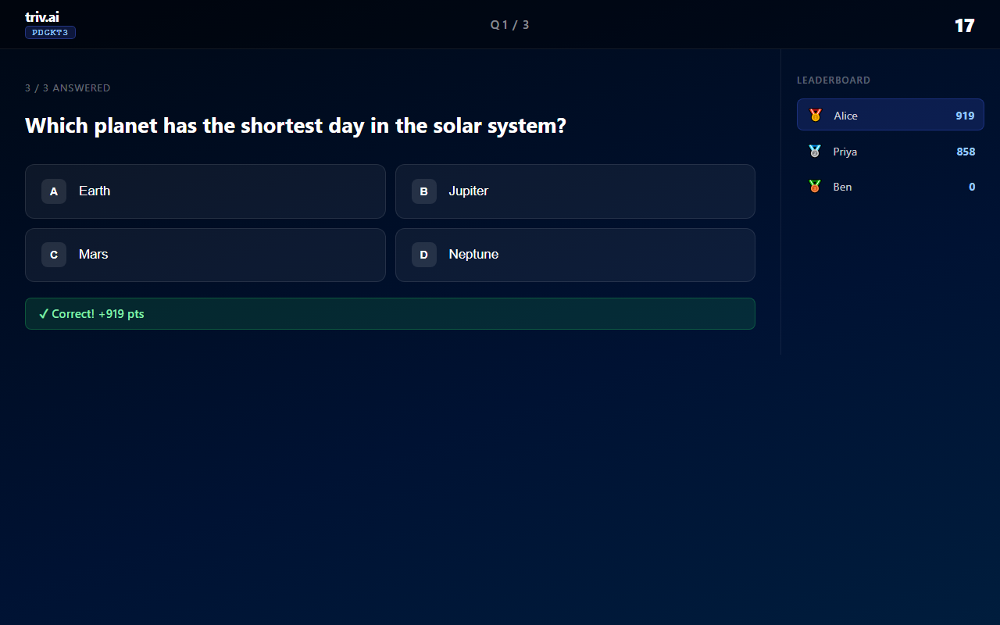
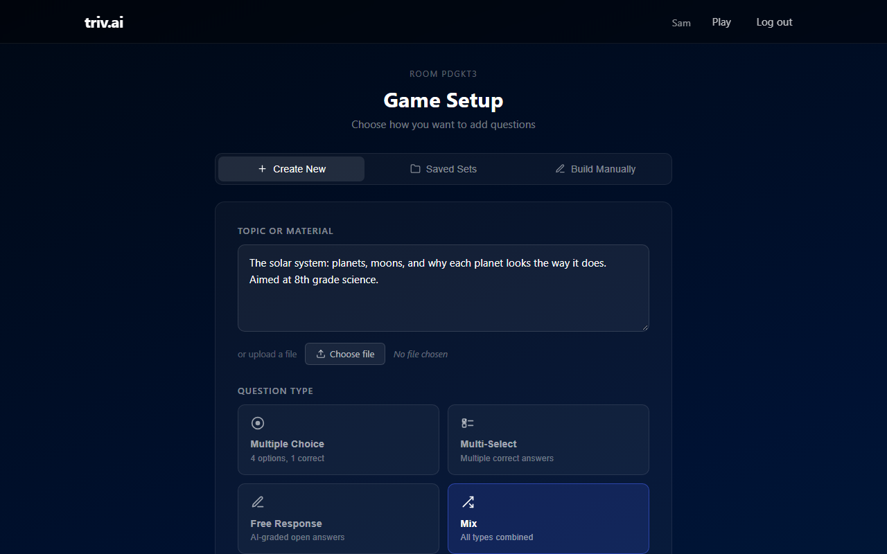
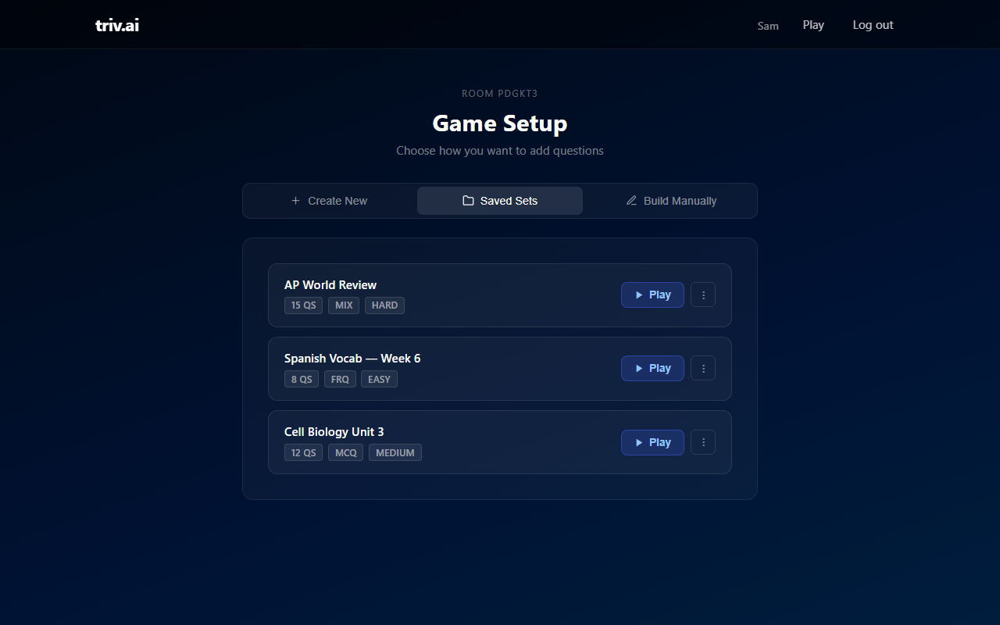
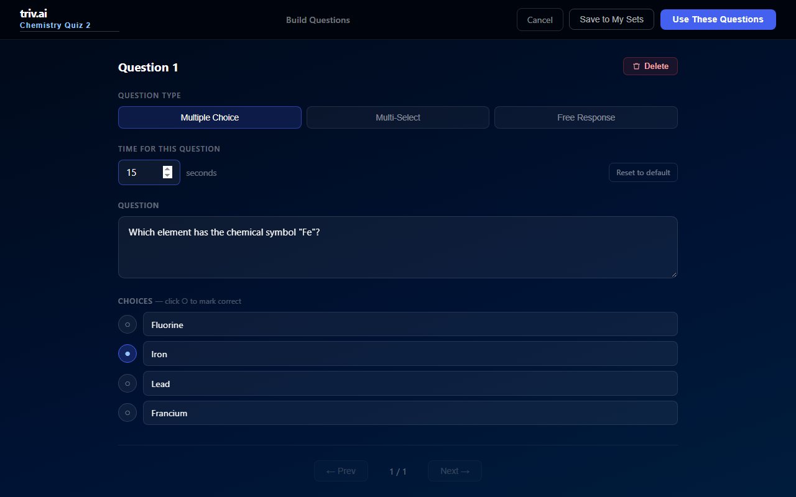
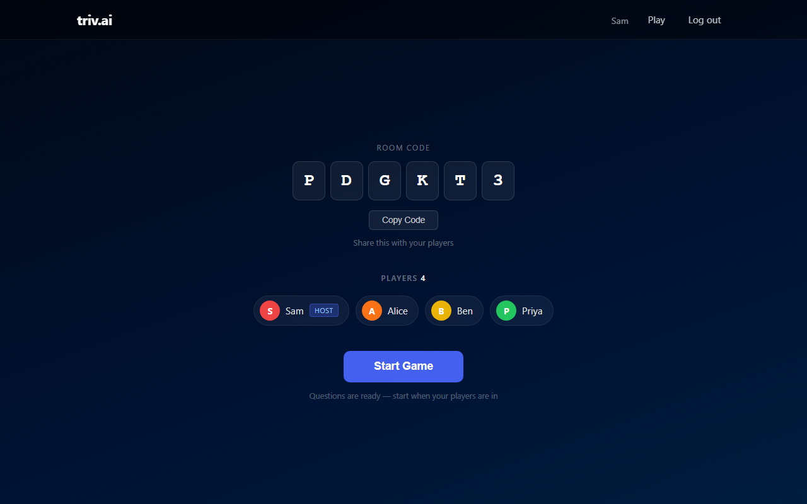
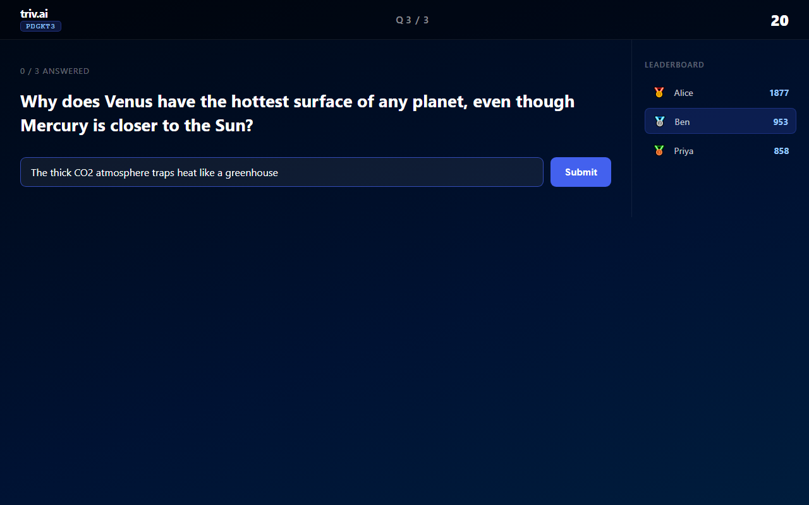
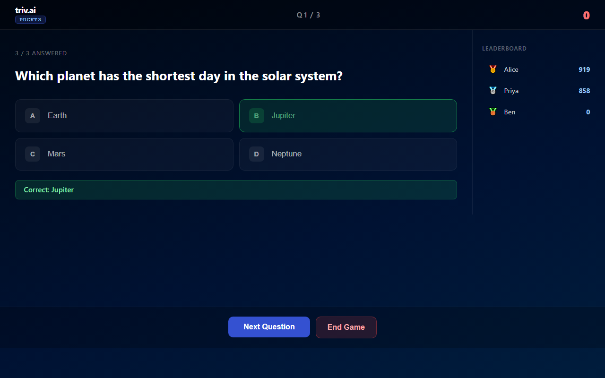
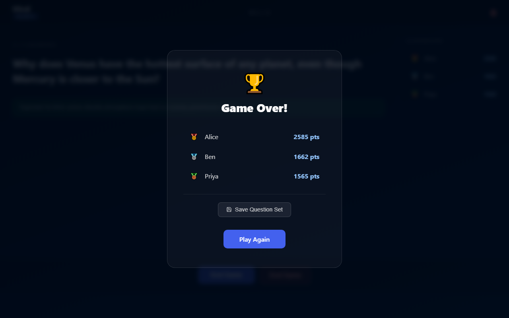

# triv.ai

A multiplayer trivia game where an AI writes the questions. Pick a topic or upload your notes, share a room code, and everyone plays live from their own device.

**Live:** https://project-b31c7095-e67e-4505-9ea.appspot.com/
&nbsp;·&nbsp; [Report a bug](https://github.com/samxu0425-coder/triv.ai/issues)



## Contents

- [About the project](#about-the-project)
  - [Built with](#built-with)
- [Getting started](#getting-started)
  - [Prerequisites](#prerequisites)
  - [Installation](#installation)
- [Usage](#usage)
- [Running the tests](#running-the-tests)
- [Deploying](#deploying)
- [Roadmap](#roadmap)
- [Contact](#contact)
- [Acknowledgments](#acknowledgments)

## About the project

Making a good quiz takes longer than playing one. triv.ai skips that part: the host types a topic ("the French Revolution", "AP Bio unit 3") or uploads a PDF, Word doc, or text file, and the questions are generated in a few seconds. Players join from their phones or laptops with a six-letter room code. They don't need an account.

There are three kinds of questions:

- **Multiple choice:** four options, one right answer.
- **Multi-select:** pick every correct option. Partly right counts as wrong.
- **Free response:** players type an answer and the AI grades it from 0 to 100%. Hosts can add a rubric ("take off 50% if they don't mention the treaty") and the grader applies it.

Scoring rewards speed. A correct answer is worth 1000 points if it's instant, sliding down to 200 at the buzzer. Free-response points are that same amount scaled by the grade.

Hosts can save question sets to reuse later, edit them question by question, set a different time limit for each question, or skip the AI entirely and write a set by hand.

### Built with

- Python and [Flask](https://flask.palletsprojects.com/), with Jinja templates and plain JavaScript (no frontend framework)
- [Groq](https://groq.com/) running Llama 3.3 70B for question generation and grading, with [OpenRouter](https://openrouter.ai/) as a fallback
- Google Cloud [Firestore](https://cloud.google.com/firestore) for users, rooms, and saved sets
- Google [App Engine](https://cloud.google.com/appengine) for hosting
- pytest and [Playwright](https://playwright.dev/python/) for tests

## Getting started

Locally the app stores everything in JSON files instead of Firestore, so you don't need a Google Cloud account to run it.

### Prerequisites

- Python 3.11 or newer
- A free Groq API key from https://console.groq.com/keys

### Installation

1. Clone the repo:
   ```sh
   git clone https://github.com/samxu0425-coder/triv.ai.git
   cd triv.ai
   ```
2. Install the dependencies:
   ```sh
   pip install -r requirements.txt
   ```
3. Create a file called `.env` in the project folder:
   ```
   SECRET_KEY=any-long-random-string
   grok_api_key=your-groq-key
   OPENROUTER_API_KEY=optional-fallback-key
   ```
   Yes, the Groq key's variable is spelled `grok_api_key`. OpenRouter is only used if Groq fails, so you can leave it out.
4. Start the server:
   ```sh
   python main.py
   ```
5. Open http://127.0.0.1:5001

Accounts you register locally are saved to `users.json` and question sets to `saved_sets.json`. Rooms only live in memory, so restarting the server ends any game in progress.

## Usage

**Host:** sign up, click **Create Game**, and choose how to get questions. You can describe a topic or upload a file and let the AI write them, load one of your saved sets, or build them by hand.



Saved sets are labelled with their question count, type, and difficulty. Hover over a set's name to rename it.



**Build Manually** opens the editor, where you write questions yourself, mark the right answers, and set a time limit for each one. The editor won't save a question that has no text or no correct answer.



The lobby shows the room code. Players go to the site, click **Play**, and enter the code and a display name. Start the game when everyone is in.



**Players:** each question has a timer (20 seconds unless the host changes it). Multiple choice and multi-select answers are scored right away. Free-response answers are graded in the background, and players see their grade when the host reveals the answer.



The host doesn't play. They run the game from their own screen: reveal the answer early, pause, move to the next question, or end the game.



Final standings show at the end, and if the questions were new, the host can save them as a set.



## Running the tests

There are three layers of tests in `tests/`:

- `test_unit.py` covers pure logic: the scoring curve, time limits, parsing the AI's responses, and free-response grading with the AI faked out.
- `test_routes.py` hits every route through Flask's test client. It covers auth, rooms, scoring, the timer, host controls, and saved sets.
- `e2e/test_browser.py` starts a real server and plays full games in Chromium, with a host and players in separate browsers.

The tests never call the real AI or touch your local data files.

```sh
pip install -r requirements-dev.txt
playwright install chromium
python -m pytest
```

To skip the browser tests, which are the slowest part:

```sh
python -m pytest -m "not e2e"
```

## Deploying

Production runs on App Engine with Firestore. `app.yaml` sets `DEV_MODE=false`, which switches storage from the JSON files to Firestore.

1. Create a Google Cloud project, then set up App Engine (Python) and a Firestore database in Native mode.
2. Create the index that the saved-sets page needs. It's also defined in `firestore.indexes.json`:
   ```sh
   gcloud firestore indexes composite create --collection-group=saved_sets \
     --field-config=field-path=owner_id,order=ascending \
     --field-config=field-path=created_at,order=descending
   ```
3. Make sure `.env` has a real `SECRET_KEY`. The file is uploaded with the app (`.gcloudignore` deliberately leaves it in), but `.gitignore` keeps it out of git.
4. Deploy:
   ```sh
   gcloud app deploy
   ```

Every deploy creates a new version. If something breaks, you can send traffic back to the previous version from the App Engine console.

## Roadmap

- [ ] Layouts that work properly on phones
- [ ] Partial credit for multi-select questions
- [ ] Animate leaderboard position changes between questions
- [ ] A shorter URL

## Contact

Sam - [@samxu0425-coder](https://github.com/samxu0425-coder)

Project: https://github.com/samxu0425-coder/triv.ai

## Acknowledgments

- [Best-README-Template](https://github.com/othneildrew/Best-README-Template), which this README is loosely based on
- [Groq](https://groq.com/) and [OpenRouter](https://openrouter.ai/) for their free tiers
